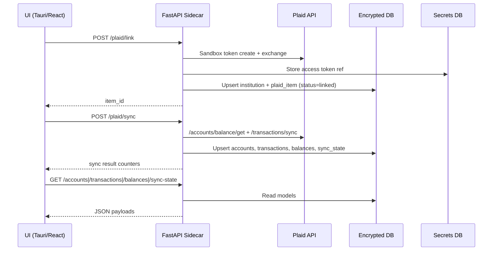

# API Layer for UI Integration (MVP)

Requirements: FUNC-ACCT-001, FUNC-ACCT-002, FUNC-ACCT-003, FUNC-ACCT-004, FUNC-ACCT-005, FUNC-ACCT-007, FUNC-SYNC-001, FUNC-TXN-001, FUNC-REP-006, FUNC-AUD-002, SEC-ACC-004, SEC-DATA-002, SEC-DATA-003, SEC-NET-002

## Problem statement
The MVP needs a local API layer that the UI can call for Plaid link/sync actions and read models for accounts, transactions, balances, and sync state.

## Architecture overview
The Python FastAPI sidecar exposes authenticated loopback endpoints and reuses existing integration modules (`plaid_client.py`, `plaid_sync.py`) plus encrypted SQLite read models.

## Data model changes
- No schema changes were required.
- Read-model endpoints map directly to existing tables: `account`, `transaction_record`, `balance_snapshot`, `sync_state`, `plaid_item`, `institution`.

## API/interface changes
- New module: `godzilla_core/api/app.py`.
- New sidecar runner: `godzilla_core/scripts/run_api_server.py`.
- New console script: `godzilla-api` (runs loopback-only API server).

Endpoints:
- `POST /plaid/link`
- `POST /plaid/sync`
- `GET /accounts`
- `GET /transactions`
- `GET /balances`
- `GET /sync-state`

`POST /plaid/link` behavior:
- Exchanges and stores the Plaid access token in the secrets DB.
- Upserts `institution` + `plaid_item` in the main DB so `/sync-state` can surface newly linked items before first sync.

Auth and config:
- All endpoints require `X-API-Key` matching `GODZILLA_API_TOKEN`.
- Main DB access uses `GODZILLA_DB_PATH` and `GODZILLA_DB_KEY`.
- Plaid flows continue to use existing Plaid env variables and secrets DB config.

## Security considerations
- Authorization boundary enforced at API layer with a required shared token header (SEC-ACC-004).
- API server script rejects non-loopback bind hosts (SEC-NET-002).
- Sensitive fields are redacted before structured error logging via `security/redaction.py` (FUNC-AUD-002, SEC-DATA-002).
- Request payload validation is enforced with Pydantic models and field constraints (SEC-DATA-003).

## Tradeoffs and alternatives considered
- Reused integration and sync modules directly to avoid duplicate business logic and reduce drift.
- Used synchronous SQLCipher calls inside async handlers for MVP simplicity; this is acceptable for local single-user sidecar traffic.

## Testing strategy and coverage mapping
- Component tests in `godzilla_core/tests/test_api_layer.py` cover:
  - auth gating
  - link/sync endpoint orchestration
  - read model responses for accounts/transactions/balances/sync state
  - redacted logging behavior
  - loopback bind enforcement in server runner

## Rollout/migration notes
- No DB migration is required.
- UI integration can call these endpoints immediately once `godzilla-api` is running with required environment variables.
