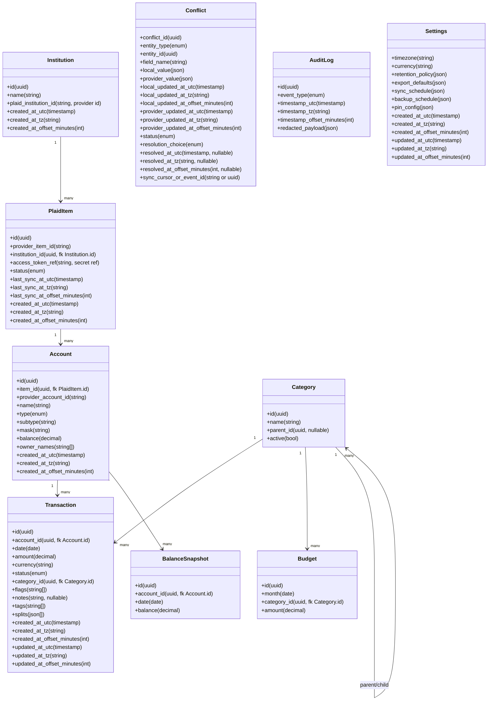
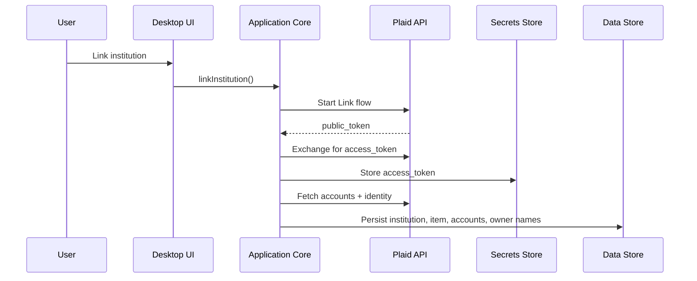
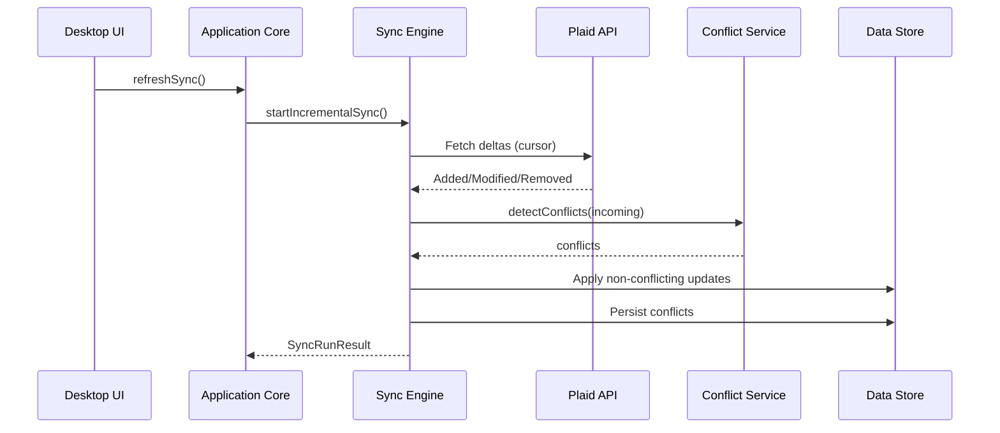
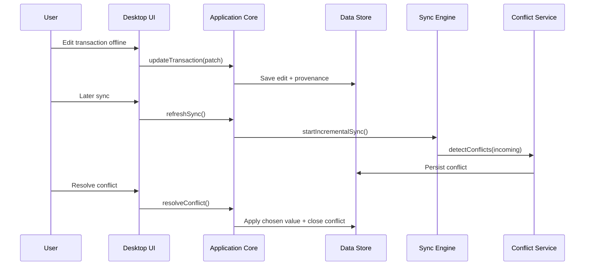
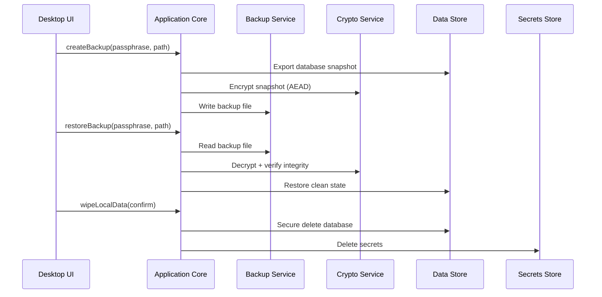
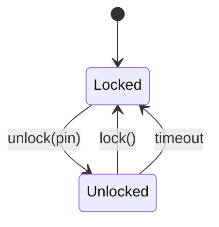

# Architecture Components (MVP)

Requirements: ACC-SYS-001, ACC-SYS-002, ACC-SYS-003, ACC-ACCT-001, ACC-ACCT-002, ACC-ACCT-003, ACC-ACCT-004, ACC-ACCT-005, ACC-ACCT-006, ACC-ACCT-007, ACC-ACCT-008, ACC-ACCT-009, ACC-SYNC-001, ACC-SYNC-002, ACC-SYNC-003, ACC-SYNC-004, ACC-SYNC-005, ACC-SYNC-006, ACC-SYNC-007, ACC-TXN-001, ACC-TXN-002, ACC-TXN-003, ACC-TXN-004, ACC-TXN-005, ACC-TXN-006, ACC-TXN-007, ACC-TXN-008, ACC-TXN-009, ACC-CAT-001, ACC-CAT-002, ACC-CAT-003, ACC-BUD-001, ACC-BUD-002, ACC-BUD-003, ACC-BUD-004, ACC-REP-001, ACC-REP-002, ACC-REP-003, ACC-REP-004, ACC-REP-005, ACC-REP-006, ACC-REP-007, ACC-REP-008, ACC-EXP-001, ACC-EXP-002, ACC-EXP-003, ACC-BKP-001, ACC-BKP-002, ACC-BKP-003, ACC-BKP-004, ACC-BKP-005, ACC-SET-001, ACC-SET-002, ACC-SET-003, ACC-SET-004, ACC-SET-005, ACC-AUD-001, ACC-AUD-002, ACC-AUD-003, ACC-AUD-004, TECH-SEC-CRY-001, TECH-SEC-CRY-002, TECH-SEC-CRY-003, TECH-SEC-CRY-004, TECH-SEC-ACC-001, TECH-SEC-ACC-002, TECH-SEC-ACC-003, TECH-SEC-ACC-004, TECH-SEC-NET-001, TECH-SEC-NET-002, TECH-SEC-NET-003, TECH-SEC-DATA-001, TECH-SEC-DATA-002, TECH-SEC-DATA-003, TECH-SEC-DATA-004, TECH-SEC-DATA-005, TECH-SEC-DATA-006, TECH-SEC-DATA-007

This document supplements `architecture-overview.md`, which is the canonical MVP architecture source.

## Goals and scope
- Define language-agnostic components, responsibilities, and interfaces for the MVP.
- Provide data contracts and invariants to guide implementation in any stack.
- Detail key workflows: Link, Sync, Offline edits and conflicts, Export, Backup/Restore, PIN access.

## Component map
| Component | Responsibilities | Inputs | Outputs | Primary requirements |
| --- | --- | --- | --- | --- |
| Desktop UI (React) | Views, forms, conflict queue, navigation | User actions | Commands, queries | ACC-SYS-001, ACC-TXN-001, ACC-BUD-001, ACC-REP-001, ACC-SYNC-007, TECH-SEC-ACC-001 |
| Tauri Host (Rust) | UI bridge, HTTPS client with cert pinning, sidecar lifecycle | UI commands | HTTPS calls, results | TECH-SEC-NET-001, TECH-SEC-NET-002 |
| Python Core (FastAPI) | Application API, orchestration | HTTPS requests | Domain outputs | ACC-SYS-001, ACC-BUD-004, ACC-SYNC-004, TECH-SEC-DATA-007 |
| Sync Engine | Incremental sync, idempotency, pending->posted, cursor | Sync trigger, Plaid deltas | Upserts, conflicts | ACC-SYNC-001..007 |
| Conflict Service | Conflict detection, queue, resolution | Local edits, provider updates | Conflict records, resolutions | ACC-SYNC-006, ACC-SYNC-007 |
| Data Store | Repositories, transactions, settings, retention | Reads/writes | Durable data | TECH-SEC-CRY-001, ACC-SET-002 |
| Domain Services | Transactions, categories, budgets, reports | App core inputs | Computed outputs | ACC-TXN-001..009, ACC-CAT-001..003, ACC-BUD-001..004, ACC-REP-001..008 |
| Export Service | CSV/JSON export with privacy controls | Filters, export options | Files | ACC-EXP-001..003 |
| Backup/Restore | Encrypted backup, restore, wipe | Passphrase, target file | Encrypted files, restored state | ACC-BKP-001..005, TECH-SEC-CRY-003 |
| Security Services | PIN gate, secrets, crypto, redaction | Auth events, secrets requests | Access decisions, encrypted blobs | TECH-SEC-ACC-001..003, TECH-SEC-CRY-001..002, ACC-AUD-002 |
| Audit Logger | Structured audit events + redaction + retention | Event data | Log entries | ACC-AUD-001..004 |
| Scheduler (optional) | Scheduled sync/backup | Schedule config | Triggered jobs | ACC-ACCT-006, ACC-BKP-005, ACC-SET-004 |

## Interfaces and contracts (language-agnostic)

### UI to Application Core
Commands:
- `linkInstitution()`
- `refreshSync()`
- `updateTransaction(transaction_id, patch)`
- `splitTransaction(transaction_id, splits[])`
- `setBudget(month, category_id, amount)`
- `exportTransactions(filter, options)`
- `exportBudgets(options)`
- `createBackup(passphrase, target_path)`
- `restoreBackup(passphrase, source_path)`
- `wipeLocalData(confirm_token)`
- `resolveConflict(conflict_id, resolution_choice)`

Queries:
- `getAccounts()`
- `getTransactions(filter, page)`
- `getBudgets(month)`
- `getReports(range)`
- `getConflicts()`
- `getSettings()`

Transport (stack decision):
- UI invokes Tauri commands, which call the local FastAPI service over HTTPS on localhost.
- The Tauri host pins the FastAPI certificate to enforce encrypted local transport.

### Application Core to Services
- Implemented as Python FastAPI handlers and domain services behind the local HTTPS API.
- Uses transaction-scoped units of work for sync ingestion and conflict creation.
- Enforces inclusion rules (transfers/excluded) consistently across budgets and reports.
- Ensures provenance markers are set for user overrides and preserved across sync.

### Sync Engine
Interface:
- `startIncrementalSync()` -> `SyncRunResult`
- `resumeSync(sync_run_id)` -> `SyncRunResult`
- `getLastSyncStatus()` -> `SyncStatus`

Behavior:
- Uses persisted cursor for incremental sync.
- Idempotently upserts by provider transaction ID or fallback heuristic.
- Maps pending->posted transitions without double counting.
- Delegates conflict detection to Conflict Service.

### Conflict Service
Interface:
- `detectConflicts(entity_type, entity_id, incoming_fields)` -> `Conflict[]`
- `queueConflicts(conflicts[])`
- `resolveConflict(conflict_id, choice)`

Behavior:
- Detects conflicts on any user-editable field.
- Local edits are preserved until user resolution.
- Resolution updates provenance (user or provider source).

### Data Store
Repositories:
- Accounts, Transactions, Categories, Budgets, Reports, Settings, Conflicts, AuditLogs.
- Uses parameterized queries, enforces retention policies.
- Stores raw provider payloads only when retention is enabled.

### Security Services
- `AuthGate`: `lock()`, `unlock(pin)`, `isUnlocked()`; enforces timeout.
- `Crypto`: encrypt/decrypt DB, backup, and sensitive blobs with authenticated encryption.
- `Secrets`: get/set/delete tokens and encryption keys in secure storage.
- `Redaction`: redact structured logs and sensitive fields by default.

## Stack-specific notes (MVP)
- Tauri v2 bundles the Python FastAPI sidecar via `externalBin`.
- FastAPI runs on loopback with HTTPS; a per-install certificate is generated and pinned in the Tauri host.
- SQLite is encrypted using SQLCipher via `sqlcipher3-binary` (self-contained wheels).
- Secrets are stored in a separate SQLCipher DB at `GODZILLA_SECRETS_PATH` using `GODZILLA_SECRETS_KEY`.
- Python sidecar is packaged with PyInstaller.

## Data contracts and invariants

### Core entities
UML-style class diagram provides the clearest view of entity fields and relationships.

Timestamp metadata: any timestamp field is stored as a UTC value plus `*_tz` (IANA timezone ID) and `*_offset_minutes` at the time of write.

### Provenance model
- Each user-editable field maintains a source marker: `provider` or `user`.
- Provider raw values are stored separately for audit/debug (subject to retention).
- User edits must not be overwritten by provider data unless resolved in conflict queue.

### Transaction invariants
- Split total equals original transaction amount.
- Transfer/excluded flags are honored by budgets and reports.
- Pending and posted states reconcile into a single posted transaction.

## Key workflows

### Plaid Link and token exchange

### Incremental sync with conflicts

### Offline edits and conflict queue

### Backup, restore, and wipe

### PIN access gate

## Error handling and resilience
- Sync is idempotent; replays do not duplicate transactions.
- Partial failures are isolated per institution with user-visible status.
- Conflicts are queued rather than overwritten.

## Security boundaries
- No secrets in client artifacts; tokens stored in secure store only.
- All logs pass through redaction layer.
- Retention policy governs raw provider payloads and logs.
- TLS enforced for Plaid communication; backoff for rate limits.

## Testing strategy
- Unit tests for conflict detection, provenance, budget math, and inclusion rules.
- Component tests for sync cursor behavior, backup/restore integrity, PIN gate.
- Security tests for log redaction and absence of secrets.
