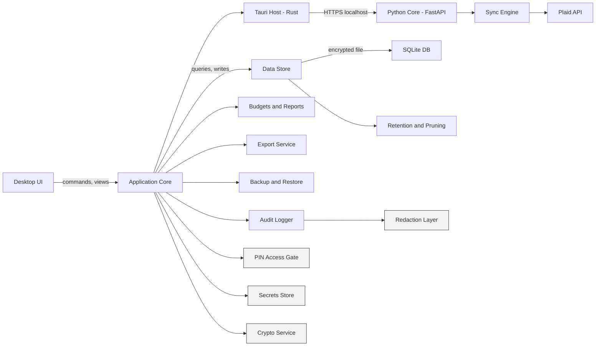
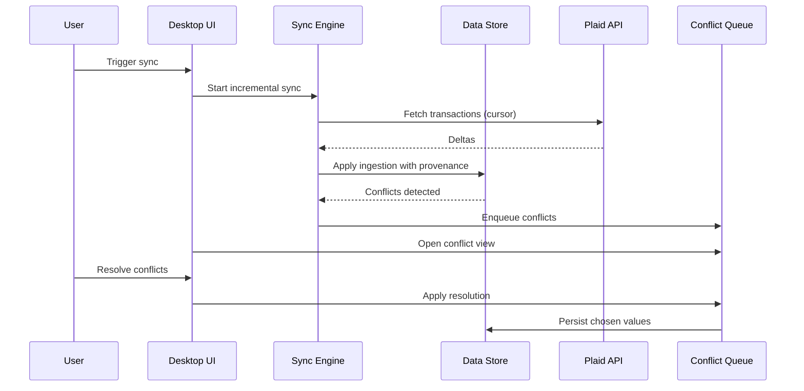

# Architecture Overview (MVP)

Requirements: ACC-SYS-001, ACC-SYS-002, ACC-SYS-003, ACC-ACCT-001, ACC-ACCT-002, ACC-ACCT-003, ACC-ACCT-004, ACC-ACCT-005, ACC-ACCT-007, ACC-ACCT-008, ACC-ACCT-009, ACC-SYNC-001, ACC-SYNC-002, ACC-SYNC-003, ACC-SYNC-004, ACC-SYNC-005, ACC-SYNC-006, ACC-SYNC-007, ACC-TXN-001, ACC-TXN-002, ACC-TXN-003, ACC-TXN-004, ACC-TXN-005, ACC-TXN-006, ACC-TXN-007, ACC-TXN-008, ACC-TXN-009, ACC-CAT-001, ACC-CAT-002, ACC-CAT-003, ACC-BUD-001, ACC-BUD-002, ACC-BUD-003, ACC-BUD-004, ACC-REP-001, ACC-REP-002, ACC-REP-003, ACC-REP-004, ACC-REP-005, ACC-REP-006, ACC-REP-007, ACC-REP-008, ACC-EXP-001, ACC-EXP-002, ACC-EXP-003, ACC-BKP-001, ACC-BKP-002, ACC-BKP-003, ACC-BKP-004, ACC-BKP-005, ACC-SET-001, ACC-SET-002, ACC-SET-003, ACC-SET-004, ACC-SET-005, ACC-AUD-001, ACC-AUD-002, ACC-AUD-003, ACC-AUD-004, TECH-SEC-CRY-001, TECH-SEC-CRY-002, TECH-SEC-CRY-003, TECH-SEC-CRY-004, TECH-SEC-ACC-001, TECH-SEC-ACC-002, TECH-SEC-ACC-003, TECH-SEC-ACC-004, TECH-SEC-NET-001, TECH-SEC-NET-002, TECH-SEC-NET-003, TECH-SEC-DATA-001, TECH-SEC-DATA-002, TECH-SEC-DATA-003, TECH-SEC-DATA-004, TECH-SEC-DATA-005, TECH-SEC-DATA-006, TECH-SEC-DATA-007

This document is the canonical MVP architecture source. Use `architecture-components.md`,
`database-schema.md`, and the other `docs/design/` files as supporting implementation detail.

## Problem statement
Build a local-only desktop budgeting application that aggregates financial accounts via Plaid, supports offline edits, and provides budgeting, reporting, export, and encrypted backup/restore while maintaining strong security and traceability.

## Architecture overview
The MVP is a single-process desktop application with a local data store (SQLite) protected by full-database encryption. The app integrates with Plaid for linking and sync, supports offline edits with conflict detection and a conflict resolution queue, centralizes security controls (PIN access gate, secrets, crypto, redaction), and now includes an in-process local scheduler for recurring sync and backup jobs.

## Implementation stack (MVP)
- Shell: Tauri v2 (Rust) with a React UI.
- Core service: Python FastAPI sidecar, bundled via Tauri `externalBin` sidecar support.
- Transport: HTTPS on localhost between the Tauri host and the Python service.
- Certificate strategy: per-install certificate generated at first run and pinned in the Tauri host.
- Data store: SQLite with SQLCipher via `sqlcipher3-binary` (self-contained wheels).
- Secrets store: separate SQLCipher file using `GODZILLA_SECRETS_PATH` and `GODZILLA_SECRETS_KEY`.
- Packaging: Python sidecar packaged with PyInstaller.

### High-level component diagram

## Component breakdown

### UI and Presentation
- Desktop UI renders accounts, transactions, budgets, reports, settings, and conflicts.
- Provides conflict resolution queue and detail views.
- Enforces access gating before displaying financial data.

### Application Core
- Orchestrates workflows and enforces requirement-level policies.
- Applies inclusion rules, caching, and state transitions for sync and conflicts.
- Maintains provenance markers for user overrides and ensures they are not overwritten.

### Sync Engine
- Handles Plaid Link initiation and token exchange.
- Performs incremental sync with cursor state and idempotent ingestion.
- Reconciles pending to posted, detects conflicts with offline edits, and queues conflicts.

### Conflict Resolution Service
- Stores conflict records with user and provider versions for any user-editable field.
- Exposes conflict queue for batch resolution; applies chosen resolution to data store.

### Data Store
- Encapsulates persistence to the encrypted SQLite database.
- Supports repository-style access for accounts, transactions, categories, budgets, reports.
- Enforces data retention settings and raw provider payload minimization rules.

### Domain Services
- Transactions: categorize, split, transfer/exclude, notes/tags, search and filters.
- Categories: hierarchy management and provider category mapping.
- Budgets: monthly plans, performance, overspend detection.
- Reports: dashboards, trends, cash flow, net worth snapshots.

### Export Service
- Exports filtered transactions, categories, budgets (CSV/JSON).
- Applies export privacy controls with raw payload exclusion by default.

### Backup and Restore
- Encrypted backups with passphrase and integrity checks.
- Restore into a clean state while preserving provenance markers.
- Wipe action removes local data and secrets.

### Security Services
- PIN access gate with session timeout and unlock configuration.
- Full-database encryption using vetted cryptography.
- Secrets store for Plaid tokens and encryption keys.
- Structured audit logging with redaction and retention.

### Scheduler (optional)
- The local runtime now hosts an in-process scheduler that reloads persisted settings, enforces single-flight execution, and triggers scheduled sync and backup jobs.
- Scheduled run outcomes are persisted to `scheduled_job_run` and surfaced through settings/UI status summaries.
- Scheduled backups require all of: scheduler support, a configured output directory, and a scheduled backup passphrase stored in the encrypted secrets store.

## Data flow: sync and conflict resolution

## Data model notes
The conceptual MVP data model consists of:
- Institution
- PlaidItem (institution connection)
- Account (belongs to item; type/subtype; mask; balances; owner names when available)
- Transaction (provider ids; posted/pending; category; user overrides; flags; splits; provenance)
- ScheduledJobRun (job type; status; timestamps; summary payload; optional error message)
- Category (hierarchy; active flag)
- Budget (month; category; amount)
- Tag (optional MVP)
- BalanceSnapshot (account; date; balance)

Implementation detail lives in supporting docs:
- `architecture-components.md` defines language-agnostic component contracts and invariants.
- `database-schema.md` defines the logical encrypted SQLite schema.
- Feature-specific docs in `docs/design/` describe workflows such as Plaid sync, conflicts, reports, and backup/restore.

## Security considerations
- Full-database encryption for all financial data (TECH-SEC-CRY-001).
- Plaid tokens and encryption keys are never stored in plaintext; use secure store (TECH-SEC-CRY-002, TECH-SEC-DATA-001).
- PIN gate and session timeout protect access (TECH-SEC-ACC-001, TECH-SEC-ACC-002, TECH-SEC-ACC-003).
- Logs are structured and redacted; raw payloads excluded by default (ACC-AUD-002, TECH-SEC-DATA-002).
- Retention and pruning apply to raw payloads and logs (ACC-SET-002, ACC-AUD-003).
- HTTPS is enforced for local service communication (loopback only) with certificate pinning in the Tauri host (TECH-SEC-NET-001, TECH-SEC-NET-002).
- TLS and rate limiting required for Plaid communications (TECH-SEC-NET-001, TECH-SEC-NET-003).

## Tradeoffs and alternatives
- SQLite is chosen for local-only MVP; a server deployment may require Postgres later.
- Full-database encryption reduces complexity vs field-level, with a single key-management path.
- Conflict resolution is user-driven to preserve offline edits and provenance.

## Testing strategy and coverage mapping
- Unit tests for sync ingestion, conflict detection/queue, budgeting math, and inclusion rules.
- Integration tests for scheduled sync/backup orchestration, provider-ID-less dedup conflicts, and benchmark dataset generation.
- Component tests for Plaid sync with cursor, offline edit reconciliation, backup/restore, and encrypted DB behavior.
- Opt-in Playwright perf tests validate responsiveness and layout requirements against a deterministic benchmark dataset.
- Security tests for PIN gating, redaction, and secret storage absence in logs.

## Rollout and migration notes
- MVP ships as a local-only desktop app with encrypted SQLite and password-based backups.
- Post-MVP server mode will require updated storage, auth, and transport considerations.
