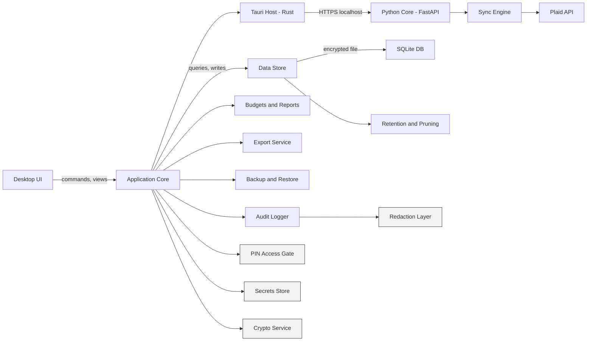
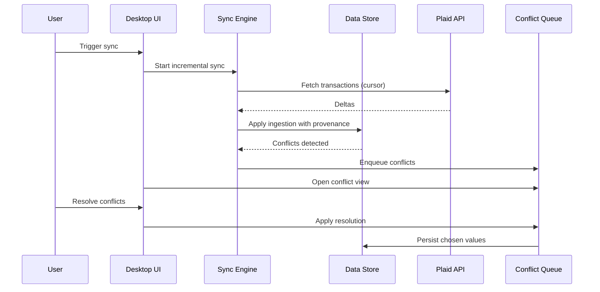

# Architecture Overview (MVP)

Requirements: SYS-001, SYS-002, SYS-003, FUNC-ACCT-001, FUNC-ACCT-002, FUNC-ACCT-003, FUNC-ACCT-004, FUNC-ACCT-005, FUNC-ACCT-007, FUNC-ACCT-008, FUNC-ACCT-009, FUNC-SYNC-001, FUNC-SYNC-002, FUNC-SYNC-003, FUNC-SYNC-004, FUNC-SYNC-005, FUNC-SYNC-006, FUNC-SYNC-007, FUNC-TXN-001, FUNC-TXN-002, FUNC-TXN-003, FUNC-TXN-004, FUNC-TXN-005, FUNC-TXN-006, FUNC-TXN-007, FUNC-TXN-008, FUNC-TXN-009, FUNC-CAT-001, FUNC-CAT-002, FUNC-CAT-003, FUNC-BUD-001, FUNC-BUD-002, FUNC-BUD-003, FUNC-BUD-004, FUNC-REP-001, FUNC-REP-002, FUNC-REP-003, FUNC-REP-004, FUNC-REP-005, FUNC-REP-006, FUNC-REP-007, FUNC-REP-008, FUNC-EXP-001, FUNC-EXP-002, FUNC-EXP-003, FUNC-BKP-001, FUNC-BKP-002, FUNC-BKP-003, FUNC-BKP-004, FUNC-BKP-005, FUNC-SET-001, FUNC-SET-002, FUNC-SET-003, FUNC-SET-004, FUNC-SET-005, FUNC-AUD-001, FUNC-AUD-002, FUNC-AUD-003, FUNC-AUD-004, SEC-CRY-001, SEC-CRY-002, SEC-CRY-003, SEC-CRY-004, SEC-ACC-001, SEC-ACC-002, SEC-ACC-003, SEC-ACC-004, SEC-NET-001, SEC-NET-002, SEC-NET-003, SEC-DATA-001, SEC-DATA-002, SEC-DATA-003, SEC-DATA-004, SEC-DATA-005, SEC-DATA-006, SEC-DATA-007

## Problem statement
Build a local-only desktop budgeting application that aggregates financial accounts via Plaid, supports offline edits, and provides budgeting, reporting, export, and encrypted backup/restore while maintaining strong security and traceability.

## Architecture overview
The MVP is a single-process desktop application with a local data store (SQLite) protected by full-database encryption. The app integrates with Plaid for linking and sync, supports offline edits with conflict detection and a conflict resolution queue, and centralizes security controls (PIN access gate, secrets, crypto, redaction). Optional scheduling is supported when a scheduler is present.

## Implementation stack (MVP)
- Shell: Tauri v2 (Rust) with a React UI.
- Core service: Python FastAPI sidecar, bundled via Tauri `externalBin` sidecar support.
- Transport: HTTPS on localhost between the Tauri host and the Python service.
- Certificate strategy: per-install certificate generated at first run and pinned in the Tauri host.
- Data store: SQLite with SQLCipher via `sqlcipher3-binary` (self-contained wheels).
- Packaging: Python sidecar packaged with PyInstaller.

### High-level component diagram

## Component breakdown

### UI and Presentation
- Desktop UI renders accounts, transactions, budgets, reports, settings, and conflicts.
- Provides conflict resolution queue and detail views.
- Enforces access gating before displaying financial data.

### Application Core
- Orchestrates workflows and enforces requirement-level policies.
- Applies inclusion rules, caching, and state transitions for sync and conflicts.
- Maintains provenance markers for user overrides and ensures they are not overwritten.

### Sync Engine
- Handles Plaid Link initiation and token exchange.
- Performs incremental sync with cursor state and idempotent ingestion.
- Reconciles pending to posted, detects conflicts with offline edits, and queues conflicts.

### Conflict Resolution Service
- Stores conflict records with user and provider versions for any user-editable field.
- Exposes conflict queue for batch resolution; applies chosen resolution to data store.

### Data Store
- Encapsulates persistence to the encrypted SQLite database.
- Supports repository-style access for accounts, transactions, categories, budgets, reports.
- Enforces data retention settings and raw provider payload minimization rules.

### Domain Services
- Transactions: categorize, split, transfer/exclude, notes/tags, search and filters.
- Categories: hierarchy management and provider category mapping.
- Budgets: monthly plans, performance, overspend detection.
- Reports: dashboards, trends, cash flow, net worth snapshots.

### Export Service
- Exports filtered transactions, categories, budgets (CSV/JSON).
- Applies export privacy controls with raw payload exclusion by default.

### Backup and Restore
- Encrypted backups with passphrase and integrity checks.
- Restore into a clean state while preserving provenance markers.
- Wipe action removes local data and secrets.

### Security Services
- PIN access gate with session timeout and unlock configuration.
- Full-database encryption using vetted cryptography.
- Secrets store for Plaid tokens and encryption keys.
- Structured audit logging with redaction and retention.

### Scheduler (optional)
- When present, triggers scheduled sync and backup jobs.
- Surfaces run outcomes in UI.

## Data flow: sync and conflict resolution

## Data model notes
- Account includes owner names (Identity) when available.
- Transaction includes raw provider values, user overrides, flags, and splits.
- Conflict records store field-level user value vs provider value with resolution state.

## Security considerations
- Full-database encryption for all financial data (SEC-CRY-001).
- Plaid tokens and encryption keys are never stored in plaintext; use secure store (SEC-CRY-002, SEC-DATA-001).
- PIN gate and session timeout protect access (SEC-ACC-001, SEC-ACC-002, SEC-ACC-003).
- Logs are structured and redacted; raw payloads excluded by default (FUNC-AUD-002, SEC-DATA-002).
- Retention and pruning apply to raw payloads and logs (FUNC-SET-002, FUNC-AUD-003).
- HTTPS is enforced for local service communication (loopback only) with certificate pinning in the Tauri host (SEC-NET-001, SEC-NET-002).
- TLS and rate limiting required for Plaid communications (SEC-NET-001, SEC-NET-003).

## Tradeoffs and alternatives
- SQLite is chosen for local-only MVP; a server deployment may require Postgres later.
- Full-database encryption reduces complexity vs field-level, with a single key-management path.
- Conflict resolution is user-driven to preserve offline edits and provenance.

## Testing strategy and coverage mapping
- Unit tests for sync ingestion, conflict detection/queue, budgeting math, and inclusion rules.
- Component tests for Plaid sync with cursor, offline edit reconciliation, backup/restore, and encrypted DB behavior.
- Security tests for PIN gating, redaction, and secret storage absence in logs.

## Rollout and migration notes
- MVP ships as a local-only desktop app with encrypted SQLite and password-based backups.
- Post-MVP server mode will require updated storage, auth, and transport considerations.
