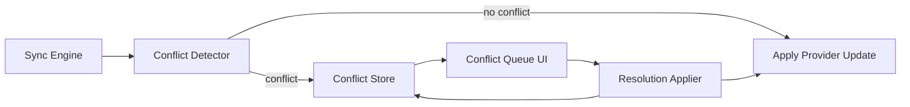

# Conflict Resolution Design (MVP)

Requirements: FUNC-SYNC-004, FUNC-SYNC-005, FUNC-SYNC-006, FUNC-SYNC-007, SEC-DATA-007, SYS-003

## Problem statement
Offline edits must be preserved across syncs while still ingesting new provider data. When an incoming change conflicts with a user edit, the system must surface the conflict and let the user decide which value to keep, without silently overwriting local edits.

## Architecture overview
Conflict resolution is an application-core service that sits between sync ingestion and persistence. It detects field-level conflicts between provider updates and user-edited values, persists conflict records, and exposes a conflict queue for batch resolution.

### Components
- Conflict Detector: compares incoming provider fields to locally edited fields and identifies conflicts.
- Conflict Store: persists conflict records in the encrypted database.
- Conflict Queue UI: lists unresolved conflicts and provides per-field resolution actions.
- Resolution Applier: applies the selected value, updates provenance, and closes the conflict.

### Flow

## Data model changes
Add a Conflict record to the local database:
- conflict_id (uuid)
- entity_type (transaction, account, category, budget, settings)
- entity_id
- field_name
- local_value
- provider_value
- local_updated_at
- provider_updated_at
- status (open, resolved)
- resolution_choice (local, provider)
- resolved_at
- sync_cursor_or_event_id

Notes:
- Conflicts are created for any user-editable field.
- Provenance markers are preserved; local edits remain authoritative until resolution.

## API and UI changes
- Sync Engine emits conflict records instead of overwriting user edits.
- Conflict Queue UI allows batch resolution and shows before/after values.
- Resolution applies selected value and updates provenance to reflect the choice.

## Security considerations
- Conflicts are stored in the encrypted database (SEC-CRY-001).
- Conflict data never includes secrets, tokens, or raw payloads beyond policy (SEC-DATA-007).
- Access is gated behind the PIN lock (SEC-ACC-001).
- Audit logs record conflict creation and resolution with redaction (FUNC-AUD-001, FUNC-AUD-002).

## Tradeoffs and alternatives
- Alternative: last-write-wins. Rejected because it can silently lose offline edits.
- Alternative: auto-merge by field priority. Rejected for lack of user intent clarity.

## Testing strategy and coverage mapping
- Unit tests:
  - Detects conflict when local edit differs from provider update.
  - Does not create conflict for unchanged or provider-only fields.
  - Applies resolution choice and updates provenance.
- Component tests:
  - Offline edit + sync produces conflict queue entry.
  - User resolution updates UI state and stored record.

## Rollout and migration notes
- MVP ships with conflict queue enabled by default for offline edits.
- No migration required beyond adding the Conflict table.
