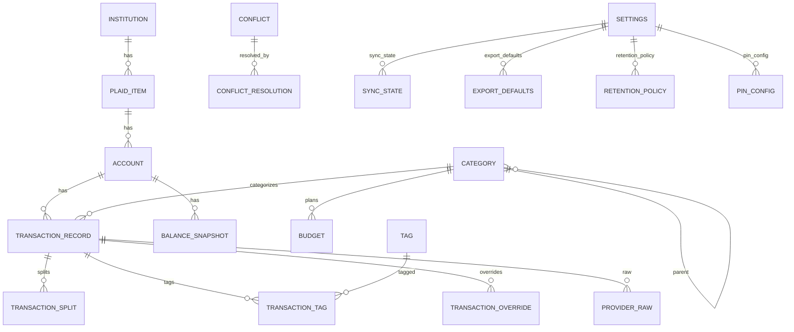

# Database Schema (MVP)

Requirements: ACC-SYS-001, ACC-SYS-002, ACC-SYS-003, ACC-ACCT-001, ACC-ACCT-002, ACC-ACCT-003, ACC-ACCT-004, ACC-ACCT-005, ACC-ACCT-008, ACC-ACCT-009, ACC-SYNC-001, ACC-SYNC-002, ACC-SYNC-003, ACC-SYNC-004, ACC-SYNC-005, ACC-SYNC-006, ACC-SYNC-007, ACC-TXN-001, ACC-TXN-002, ACC-TXN-003, ACC-TXN-004, ACC-TXN-005, ACC-TXN-006, ACC-TXN-007, ACC-TXN-008, ACC-TXN-009, ACC-CAT-001, ACC-CAT-002, ACC-CAT-003, ACC-BUD-001, ACC-BUD-002, ACC-BUD-003, ACC-BUD-004, ACC-REP-005, ACC-REP-006, ACC-SET-001, ACC-SET-002, ACC-SET-003, ACC-SET-005, ACC-AUD-001, ACC-AUD-002, ACC-AUD-003, TECH-SEC-CRY-001, TECH-SEC-CRY-003, TECH-SEC-ACC-001, TECH-SEC-ACC-002, TECH-SEC-ACC-003, TECH-SEC-DATA-005, TECH-SEC-DATA-006, TECH-SEC-DATA-007

This document supplements `architecture-overview.md`, which is the canonical MVP architecture source.

## Problem statement
Define a normalized, encrypted SQLite schema that supports sync, offline edits, conflicts, budgeting, reporting, and audit logging, with retention controls and provenance tracking.

## ER overview

## Tables (logical)

### schema_version
- `version` (int, not null)
- `applied_at_utc` (timestamp, not null)
- `applied_at_tz` (text, not null)
- `applied_at_offset_minutes` (int, not null)

### institution
- `id` (uuid, pk)
- `name` (text, not null)
- `plaid_institution_id` (text, not null, unique)
- `created_at_utc` (timestamp, not null)
- `created_at_tz` (text, not null)
- `created_at_offset_minutes` (int, not null)

### plaid_item
- `id` (uuid, pk)
- `provider_item_id` (text, not null, unique)
- `institution_id` (uuid, fk institution.id, not null)
- `access_token_ref` (text, not null)  // secret ref in secure store
- `status` (text enum, not null)       // linked, requires_reauth, error
- `last_sync_at_utc` (timestamp, nullable)
- `last_sync_at_tz` (text, nullable)
- `last_sync_at_offset_minutes` (int, nullable)
- `created_at_utc` (timestamp, not null)
- `created_at_tz` (text, not null)
- `created_at_offset_minutes` (int, not null)

### account
- `id` (uuid, pk)
- `item_id` (uuid, fk plaid_item.id, not null)
- `provider_account_id` (text, not null, unique)
- `name` (text, not null)
- `type` (text enum, not null)
- `subtype` (text, nullable)
- `mask` (text, nullable)
- `balance` (decimal, nullable)
- `currency` (text, not null)
- `owner_names` (json, nullable) // list of strings
- `created_at_utc` (timestamp, not null)
- `created_at_tz` (text, not null)
- `created_at_offset_minutes` (int, not null)

### transaction_record
- `id` (uuid, pk)
- `account_id` (uuid, fk account.id, not null)
- `provider_transaction_id` (text, nullable) // may be null
- `date` (date, not null)
- `amount` (decimal, not null)
- `currency` (text, not null)
- `status` (text enum, not null) // pending, posted
- `merchant_name` (text, nullable)
- `display_name` (text, not null)
- `category_id` (uuid, fk category.id, nullable)
- `is_transfer` (bool, not null default false)
- `is_excluded` (bool, not null default false)
- `notes` (text, nullable)
- `created_at_utc` (timestamp, not null)
- `created_at_tz` (text, not null)
- `created_at_offset_minutes` (int, not null)
- `updated_at_utc` (timestamp, not null)
- `updated_at_tz` (text, not null)
- `updated_at_offset_minutes` (int, not null)

### transaction_split
- `id` (uuid, pk)
- `transaction_id` (uuid, fk transaction_record.id, not null)
- `amount` (decimal, not null)
- `category_id` (uuid, fk category.id, nullable)
- `notes` (text, nullable)

### tag
- `id` (uuid, pk)
- `name` (text, not null, unique)
- `active` (bool, not null default true)

### transaction_tag
- `transaction_id` (uuid, fk transaction_record.id, not null)
- `tag_id` (uuid, fk tag.id, not null)
- primary key (`transaction_id`, `tag_id`)

### category
- `id` (uuid, pk)
- `name` (text, not null)
- `parent_id` (uuid, fk category.id, nullable)
- `active` (bool, not null default true)

### budget
- `id` (uuid, pk)
- `month` (date, not null) // first day of month
- `category_id` (uuid, fk category.id, not null)
- `amount` (decimal, not null)

### balance_snapshot
- `id` (uuid, pk)
- `account_id` (uuid, fk account.id, not null)
- `date` (date, not null)
- `balance` (decimal, not null)
- unique (`account_id`, `date`)

### transaction_override
Tracks field-level user overrides and provenance markers.
- `id` (uuid, pk)
- `transaction_id` (uuid, fk transaction_record.id, not null)
- `field_name` (text, not null)
- `source` (text enum, not null) // provider, user
- `provider_value` (json, nullable)
- `user_value` (json, nullable)
- `updated_at_utc` (timestamp, not null)
- `updated_at_tz` (text, not null)
- `updated_at_offset_minutes` (int, not null)

### provider_raw
Raw provider payloads (subject to retention).
- `id` (uuid, pk)
- `transaction_id` (uuid, fk transaction_record.id, not null)
- `raw_payload` (json, not null)
- `created_at_utc` (timestamp, not null)
- `created_at_tz` (text, not null)
- `created_at_offset_minutes` (int, not null)

### conflict
- `conflict_id` (uuid, pk)
- `entity_type` (text enum, not null)
- `entity_id` (uuid, not null)
- `field_name` (text, not null)
- `local_value` (json, not null)
- `provider_value` (json, not null)
- `local_updated_at_utc` (timestamp, not null)
- `local_updated_at_tz` (text, not null)
- `local_updated_at_offset_minutes` (int, not null)
- `provider_updated_at_utc` (timestamp, not null)
- `provider_updated_at_tz` (text, not null)
- `provider_updated_at_offset_minutes` (int, not null)
- `status` (text enum, not null) // open, resolved
- `resolution_choice` (text enum, nullable) // local, provider
- `resolved_at_utc` (timestamp, nullable)
- `resolved_at_tz` (text, nullable)
- `resolved_at_offset_minutes` (int, nullable)
- `sync_cursor_or_event_id` (text, nullable)

### conflict_resolution
- `id` (uuid, pk)
- `conflict_id` (uuid, fk conflict.conflict_id, not null)
- `resolved_by` (text, not null) // user
- `resolved_at_utc` (timestamp, not null)
- `resolved_at_tz` (text, not null)
- `resolved_at_offset_minutes` (int, not null)
- `choice` (text enum, not null)

### audit_log
- `id` (uuid, pk)
- `event_type` (text enum, not null)
- `timestamp_utc` (timestamp, not null)
- `timestamp_tz` (text, not null)
- `timestamp_offset_minutes` (int, not null)
- `redacted_payload` (json, not null)

### settings
Single-row table (single-user scope).
- `id` (uuid, pk)
- `timezone` (text, not null)
- `currency` (text, not null)
- `created_at_utc` (timestamp, not null)
- `created_at_tz` (text, not null)
- `created_at_offset_minutes` (int, not null)
- `updated_at_utc` (timestamp, not null)
- `updated_at_tz` (text, not null)
- `updated_at_offset_minutes` (int, not null)

### retention_policy
Single-row table.
- `id` (uuid, pk)
- `retain_raw_payloads` (bool, not null default true)
- `retain_logs_days` (int, not null)
- `created_at_utc` (timestamp, not null)
- `created_at_tz` (text, not null)
- `created_at_offset_minutes` (int, not null)
- `updated_at_utc` (timestamp, not null)
- `updated_at_tz` (text, not null)
- `updated_at_offset_minutes` (int, not null)

### export_defaults
Single-row table.
- `id` (uuid, pk)
- `include_raw_payloads` (bool, not null default false)
- `created_at_utc` (timestamp, not null)
- `created_at_tz` (text, not null)
- `created_at_offset_minutes` (int, not null)
- `updated_at_utc` (timestamp, not null)
- `updated_at_tz` (text, not null)
- `updated_at_offset_minutes` (int, not null)

### pin_config
Single-row table.
- `id` (uuid, pk)
- `pin_hash` (text, not null)
- `pin_salt` (text, not null)
- `updated_at_utc` (timestamp, not null)
- `updated_at_tz` (text, not null)
- `updated_at_offset_minutes` (int, not null)

### sync_state
Per-item cursor and last-run state.
- `id` (uuid, pk)
- `item_id` (uuid, fk plaid_item.id, not null)
- `plaid_cursor` (text, nullable)
- `last_sync_at_utc` (timestamp, nullable)
- `last_sync_at_tz` (text, nullable)
- `last_sync_at_offset_minutes` (int, nullable)
- `last_sync_status` (text, nullable)

## Constraints and indexes
- Unique index on `transaction_record.provider_transaction_id` when not null.
- Index on `transaction_record.date`, `transaction_record.amount`, `transaction_record.category_id` for filters.
- Index on `transaction_record.account_id` for list/detail views.
- Index on `conflict.status` for queue performance.
- Foreign keys enforced (PRAGMA foreign_keys=ON).
- Unique index on `account.provider_account_id`.
- Unique index on `sync_state.item_id`.

## Security considerations
- Database file is encrypted with SQLCipher (TECH-SEC-CRY-001).
- Raw provider payloads are optional and prunable based on retention policy (ACC-SET-002, TECH-SEC-DATA-005).
- Audit log payloads must be redacted before write (ACC-AUD-002).
- PIN secrets stored as salted hash; raw PIN is never persisted (TECH-SEC-ACC-001, TECH-SEC-ACC-003).

## Migration strategy
- Use versioned SQL migrations (e.g., `migrations/0001_init.sql`).
- Maintain a `schema_version` table with the latest applied version.
- Migrations are applied at app startup by the Python core before serving requests.

## Testing strategy
- Schema migration tests to verify creation and upgrade paths.
- Query tests for transaction filters, conflict queue, and retention pruning.
