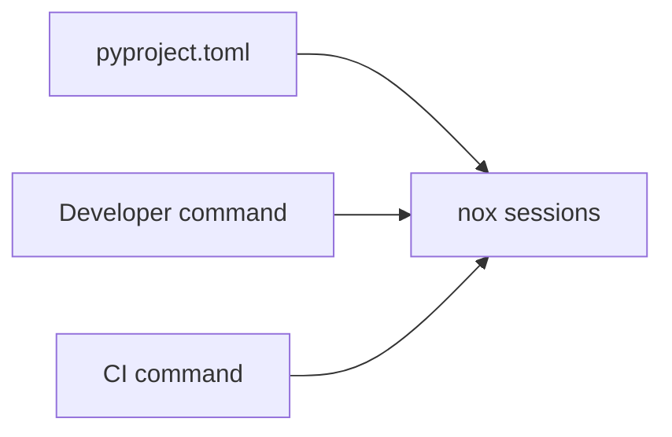

# Developer Tooling Design (MVP)

Requirements: SEC-DATA-004

## Problem statement
The project needs a single, consistent Python formatting workflow so local development and CI enforce the same style constraints and dependency hygiene controls.

## Architecture overview
Black and Ruff are configured from `pyproject.toml`. Nox sessions execute formatter/linter checks for local and CI runs.

## Data model changes
None.

## API/interface changes
- Add `[tool.black]` with the same line length and target version as Ruff.
- Add `nox -s format` session for automatic formatting.
- Update `nox -s lint` to include `black --check`.

## Security considerations
- Supports dependency hygiene by keeping formatter dependencies declared and version constrained in project metadata.

## Tradeoffs and alternatives considered
- Alternative: rely only on Ruff checks. Rejected because this change explicitly requires Black formatting support.
- Alternative: run formatter manually without Nox. Rejected to reduce drift between local and CI commands.

## Testing strategy and coverage mapping
- Unit test validates Black and Ruff config alignment and checks Black exists in dev dependencies.

## Rollout/migration notes
- Run `python3 -m pip install -e ".[dev]"` to ensure Black is available.
