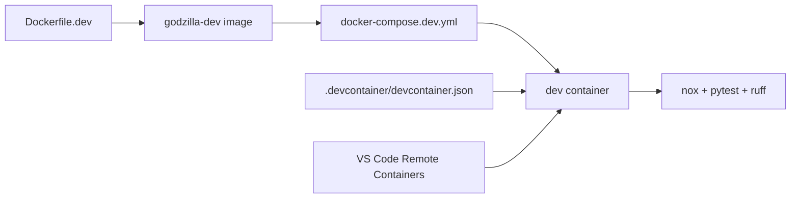

# Developer Tooling Design (MVP)

Requirements: SEC-DATA-004

## Problem statement
The project needs a reproducible containerized development environment so every contributor can run the same pinned toolchain (Python, Node, Rust, lint/test/build tooling) and attach VS Code to the running environment without host-specific setup drift.

## Architecture overview
Containerized development uses four assets:
- `Dockerfile.dev` defines the pinned Linux toolchain and developer user.
- `docker-compose.dev.yml` runs a long-lived `dev` service with named volumes for workspace, app data, and dependency caches.
- `docker-compose.dev.ssh-agent.yml` optionally forwards host SSH agent sockets for Git operations without copying private keys.
- `.devcontainer/devcontainer.json` lets VS Code open or attach directly to the `dev` service.
- Existing `pyproject.toml` and `noxfile.py` remain the source of truth for Python dependencies and quality commands run inside the container.

## Data model changes
None.

## API/interface changes
- Add `Dockerfile.dev` with Python 3.12, Node.js 24 LTS, Rust stable, Git, and Linux build prerequisites.
- Add `docker-compose.dev.yml` with pure named-volume workspace/data mounts and persistent dependency caches.
- Add a stable container name (`godzilla-dev`) for repeatable manual container operations.
- Add `docker-compose.dev.ssh-agent.yml` as an optional SSH agent forwarding overlay for Git SSH workflows.
- Add `.devcontainer/devcontainer.json` so VS Code can attach to the running containerized environment.
- Add `.dockerignore` to keep the build context minimal and deterministic.

## Security considerations
- The container image excludes application secrets; sensitive environment variables are injected at runtime.
- Git and network tooling are available without storing credentials in the image layers.
- Private SSH keys are not copied into container volumes. Host SSH agent forwarding is used when SSH-based Git authentication is required.
- Dependency versions are pinned or constrained in image build steps and project metadata to support predictable builds.

## Tradeoffs and alternatives considered
- Alternative: host-native setup only. Rejected because host package drift creates inconsistent local builds.
- Alternative: separate ad-hoc Docker commands without Dev Container metadata. Rejected because VS Code attach/open workflows are a key requirement.

## Testing strategy and coverage mapping
- Unit tests validate Dockerfile toolchain declarations, Compose service configuration, Dev Container wiring, and presence of operational setup documentation.
- Existing tooling tests continue validating lint/test/build dependency hygiene rules.

## Rollout/migration notes
- Build once: `docker compose -f docker-compose.dev.yml build dev`.
- Start environment: `docker compose -f docker-compose.dev.yml up -d dev`.
- Run checks in container: `docker compose -f docker-compose.dev.yml exec dev nox -s lint tests build`.
- Use VS Code "Dev Containers: Attach to Running Container..." targeting the `dev` service container.
