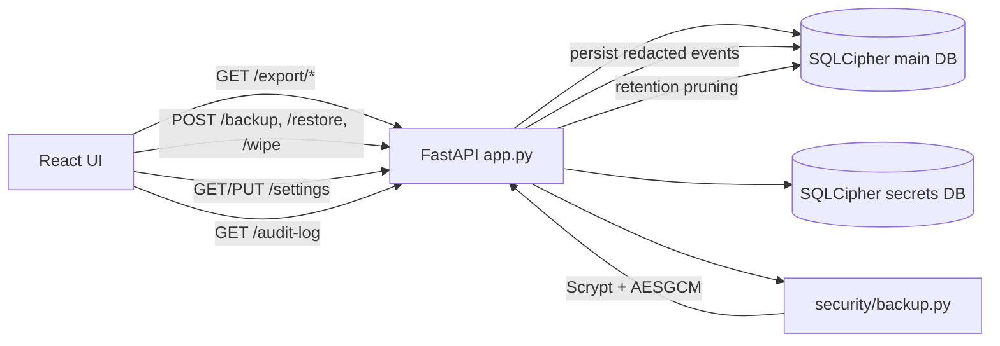

# M5 Design — Export, Backup/Restore, Settings, Audit

Requirements: FUNC-EXP-001, FUNC-EXP-002, FUNC-EXP-003, FUNC-BKP-001, FUNC-BKP-002, FUNC-BKP-003, FUNC-BKP-004, FUNC-SET-001, FUNC-SET-002, FUNC-SET-003, FUNC-SET-004, FUNC-SET-005, FUNC-AUD-001, FUNC-AUD-003, FUNC-AUD-004, FUNC-REP-006

## Problem statement

M5 adds data portability and lifecycle controls that were missing in M1-M4:

1. Export workflows for transactions and category/budget structures.
2. Encrypted backup/restore/wipe for local data safety and device transfer.
3. Persisted user settings for retention/export/security/sync preferences.
4. Durable audit history with redaction, retention, and export.

## Architecture overview

## Data model changes

1. Migration `0003_m5_settings_extensions.sql` extends `settings` with:
   - `auto_lock_minutes`
   - `sync_schedule_enabled`
   - `sync_frequency_minutes`
2. Existing singleton tables reused:
   - `retention_policy`
   - `export_defaults`
3. Existing `audit_log` table reused for persisted redacted events and CSV/JSON export.

## API/interface changes

1. `GET /export/transactions`
   - Reuses transaction filters from `/transactions`.
   - Emits one CSV row per split for split transactions.
   - `include_raw_payloads` optional; defaults to `export_defaults.include_raw_payloads`.
2. `GET /export/categories-budgets`
   - `format=csv|json`, optional `month=YYYY-MM`.
3. `POST /backup`
   - JSON body with passphrase and optional secrets inclusion.
   - Returns encrypted binary attachment.
4. `POST /restore`
   - Multipart form with passphrase and backup file.
   - Decrypts + verifies envelope integrity, atomically replaces DB files, reruns migrations.
5. `POST /wipe`
   - Requires `confirm=WIPE_LOCAL_DATA`; best-effort overwrite and unlink for DB/secrets sidecars.
6. `GET /settings` and `PUT /settings`
   - Consolidated settings payload across settings/retention/export_defaults.
   - PUT applies retention side effects (`provider_raw`, `audit_log` pruning).
7. `GET /audit-log`
   - Supports filters, pagination, and `format=json|csv`.
8. `/balances`
   - Includes `account_name` for user-friendly display.

## Security considerations

1. Backup encryption uses vetted primitives (`Scrypt`, `AESGCM`) via `cryptography`.
2. Backup/restore failures return explicit integrity/format errors; tampered payloads are rejected.
3. Audit payloads are redacted before logging and persistence.
4. Wipe path clears DB/secrets sidecars (`-wal`, `-shm`) in addition to primary files.
5. Export privacy defaults are conservative (`include_raw_payloads=false`).

## Tradeoffs and alternatives

1. Wipe is best-effort overwrite + unlink; filesystem guarantees vary by platform.
2. Audit CSV export is paginated by endpoint limit (`<=200`) to avoid large in-memory responses.
3. Auto-lock/scheduler values persist in M5; runtime enforcement is deferred to M6.

## Testing strategy and coverage mapping

1. Backend endpoint tests in `godzilla_core/tests/test_api_layer.py` validate:
   - Export correctness and validation paths.
   - Backup encryption, tamper detection, restore, wipe.
   - Settings defaults/updates/validation/pruning.
   - Audit persistence/filtering/export/retention.
2. Frontend tests validate:
   - `ExportPanel`, `DataManagementPanel`, `SettingsPanel` behavior and request wiring.
   - `App` integration of new panels.
3. Traceability mapping is maintained in `trace/requirements.yml`.

## Rollout and migration notes

1. Run `migrations` before starting API to apply version 3 schema.
2. Existing installations without settings rows read safe defaults from API.
3. No destructive migration is required; restore/wipe are explicit user-triggered workflows.
