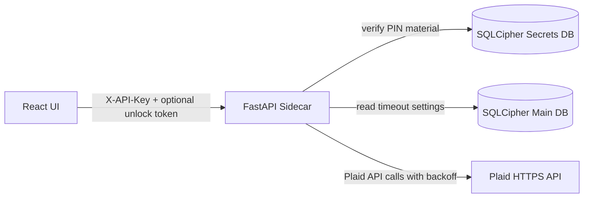
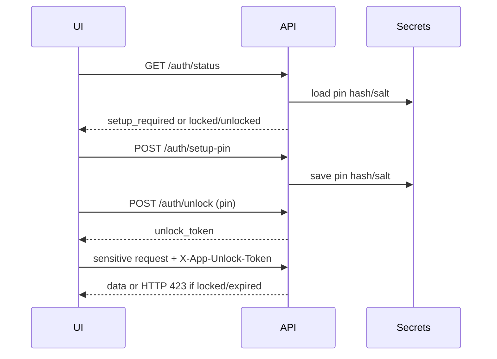

# M6 Security Review Pass
Requirements: FUNC-ACCT-008, FUNC-SET-003, SEC-ACC-001, SEC-ACC-002, SEC-ACC-003, SEC-NET-001, SEC-NET-002, SEC-NET-003, SEC-DATA-004, SEC-CRY-004

## Problem Statement
M6 introduces runtime security controls that were previously planned but not enforced:
- app PIN setup/unlock gate with inactivity timeout
- transport hardening for local sidecar TLS operation
- robust retry/backoff behavior for Plaid transient failures
- institution unlink workflow with token revocation/deletion semantics
- explicit dependency vulnerability scanning session

## Architecture Overview

### Auth Gate Flow

## Data Model Changes
- Added migration `migrations/0004_m6_unlink_state.sql`.
- Added `plaid_item.is_unlinked INTEGER NOT NULL DEFAULT 0 CHECK (0/1)`.
- Keep mode marks `is_unlinked=1` and `status='requires_reauth'`.
- Purge mode deletes `plaid_item` and cascades item-linked data.

## API/Interface Changes
- `GET /auth/status`
- `POST /auth/setup-pin`
- `POST /auth/unlock`
- `DELETE /plaid/items/{item_id}?mode=keep|purge`
- Existing protected endpoints now enforce lock state unless `GODZILLA_DEV_BYPASS_PIN=1`.
- `godzilla-api` runner accepts TLS cert/key via CLI/env and passes them to uvicorn.

## Security Considerations
- PIN material is stored in secure secrets storage (PBKDF2-HMAC-SHA256 hash + random salt).
- Unlock session tokens are in-memory only, refreshed on activity, and expire on inactivity.
- TLS status endpoint returns certificate fingerprint only (no private material).
- Plaid client retries only transient failures (429/5xx/network), with exponential backoff + jitter.
- Unlink always removes local token reference; remote revoke is attempted when access token is present.

## Tradeoffs
- Unlock sessions are process-memory only; API restart invalidates sessions.
- Current UI runtime transport still uses browser/dev proxy and API client HTTPS base; Tauri pinned proxy command is tracked for remaining M6 work.
- Unlink remote revoke is best-effort to avoid hard-failing local unlink when provider revoke is unavailable.

## Rollout Notes
- For strict lock behavior in local dev/test, set:
  - `GODZILLA_DEV_BYPASS_PIN=0`
- For dev bypass during automated tests:
  - `GODZILLA_DEV_BYPASS_PIN=1`
