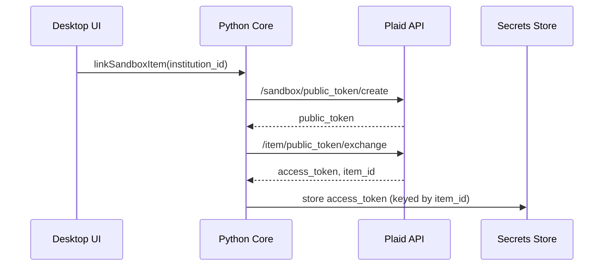
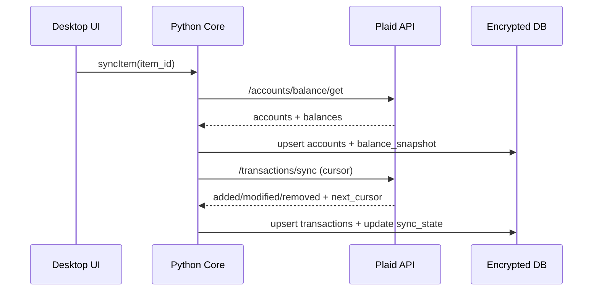

# Plaid Sandbox Integration (MVP)

Requirements: FUNC-ACCT-001, FUNC-ACCT-002, FUNC-ACCT-003, FUNC-ACCT-005, FUNC-ACCT-007, FUNC-SYNC-001, FUNC-SYNC-002, FUNC-SYNC-003, FUNC-REP-006, SEC-DATA-001, SEC-CRY-002, SEC-NET-001, SEC-NET-003

## Problem statement
The MVP must connect to Plaid sandbox to create a Link session, exchange the public token for an access token, and store that access token securely. Transactions and balances are retrieved via Plaid endpoints using the stored token.

## Architecture overview
The Python core exposes a Plaid client that calls Plaid APIs over HTTPS using sandbox configuration. Access tokens are stored in the encrypted secrets store and never written to the main application database.



## Sync and persistence
When a manual sync is triggered, the core pulls balances and incremental transactions for the linked item. Account metadata and balances are upserted into the encrypted DB, transactions are ingested idempotently, and the sync cursor is persisted.



## API/interface changes
## Dev CLI
Use the helper script to create a sandbox item and store the access token:

```bash
python3 godzilla_core/scripts/link_sandbox_item.py \
  --institution-id ins_109508 \
  --products transactions,balance,identity
```

To sync transactions and balances into the main DB:

```bash
python3 godzilla_core/scripts/sync_plaid_item.py \
  --item-id <item_id> \
  --institution-id ins_109508
```

- `PlaidConfig.from_env()` reads `PLAID_CLIENT_ID`, `PLAID_SECRET`, `PLAID_ENV`.
- `PlaidClient.create_sandbox_public_token()`
- `PlaidClient.exchange_public_token()`
- `link_sandbox_item()` convenience method storing tokens in `SecretStore`.

## Security considerations
- Access tokens are stored only in SQLCipher secrets DB (SEC-CRY-002).
- Tokens are never stored in the main DB or logs (SEC-DATA-001).
- All Plaid calls use HTTPS and follow backoff guidance (SEC-NET-001, SEC-NET-003).

## Tradeoffs and alternatives
- Using Plaid SDK vs raw HTTP: raw HTTP avoids extra dependencies but requires explicit error handling.

## Testing strategy and coverage mapping
- Unit tests for config parsing and token storage.
- SKIP tests for live sandbox calls until a Plaid sandbox test harness is wired.

## Rollout notes
- Requires `PLAID_CLIENT_ID` and `PLAID_SECRET` in the environment.
- Sandbox institution defaults to `ins_109508` unless overridden.
