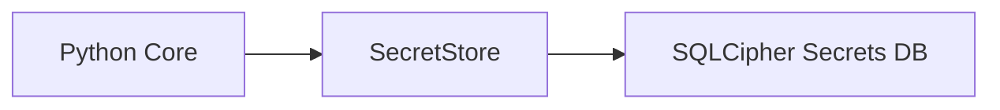

# Secrets Store Design (MVP)

Requirements: SEC-CRY-002, SEC-DATA-001, FUNC-ACCT-002, SYS-003

## Problem statement
Provider access tokens and encryption keys must be stored in a protected local store and never embedded in client artifacts or logs. The secrets store must be encrypted, local-only, and used by the Python core for Plaid access tokens.

## Architecture overview
A dedicated SQLCipher database is used for secrets, separate from the main application database. Access is controlled by `GODZILLA_SECRETS_KEY` and stored at `GODZILLA_SECRETS_PATH`.

## Data model
Table: `secrets`
- `key` (text, primary key)
- `value` (text, not null)
- `updated_at_utc` (timestamp, not null)
- `updated_at_tz` (text, not null)
- `updated_at_offset_minutes` (int, not null)

## API/interface changes
- `SecretStore.set_secret(key, value)`
- `SecretStore.get_secret(key)`
- `SecretStore.delete_secret(key)`
- `store_from_env()` uses `GODZILLA_SECRETS_PATH` and `GODZILLA_SECRETS_KEY`

## Security considerations
- Secrets are stored only in the encrypted secrets DB (SEC-CRY-002).
- No secrets are logged or embedded in client artifacts (SEC-DATA-001).
- Access tokens are not stored in the main application DB (FUNC-ACCT-002).

## Tradeoffs and alternatives
- Alternative: OS keychain. Deferred to post-MVP for portability and simplicity.
- Alternative: store access tokens in main DB. Rejected to minimize blast radius.

## Testing strategy and coverage mapping
- Unit test for secret set/get/delete roundtrip.
- Component tests to be added once Plaid integration is wired.

## Rollout notes
- Secrets DB is created on first use and stored under `GODZILLA_SECRETS_PATH`.
