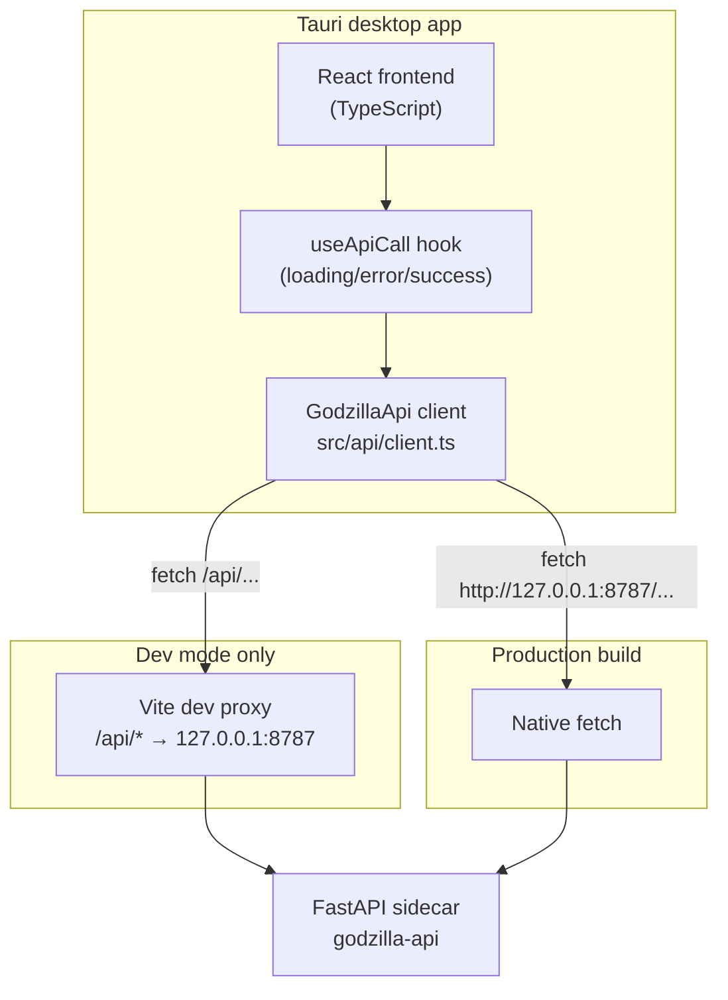
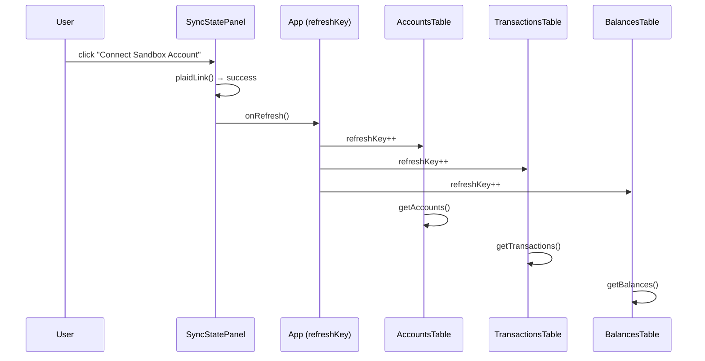

# UI Frontend Scaffold and API Client

Requirements: FUNC-ACCT-001, FUNC-ACCT-002, FUNC-ACCT-003, FUNC-ACCT-004,
FUNC-ACCT-005, FUNC-SYNC-001, FUNC-TXN-001, FUNC-REP-006, SEC-NET-001,
SEC-NET-002, SEC-ACC-004

## Problem statement

The MVP requires a desktop frontend that communicates with the local Python
FastAPI sidecar.  The UI must work in both Vite development mode (with the
proxy) and in production Tauri builds, and must present a consistent
loading/error/success contract to every view that calls the backend.

## Architecture overview



### Base URL selection

`import.meta.env.DEV` is `true` in Vite dev server and `false` in a production
bundle.  The client uses this flag to select the correct base URL:

| Context | `import.meta.env.DEV` | Base URL |
|---|---|---|
| `npm run dev` / `tauri dev` | `true` | `/api` (Vite proxy) |
| `tauri build` | `false` | `http://127.0.0.1:8787` |

## Node.js version pin

`.nvmrc` in `ui/` pins Node.js **24 LTS**.  The devcontainer and any CI runner
should activate this version via `nvm use` or equivalent before installing
dependencies.

## Tauri configuration

`src-tauri/tauri.conf.json` sets:

- `productName`: `"Godzilla"`
- Window title: `"Godzilla"`, minimum size 800×500
- **CSP**: restricts frontend to self-hosted assets plus `connect-src` to
  `http://127.0.0.1:8787` (the sidecar).  Inline scripts are blocked.

## Vite dev proxy

`vite.config.ts` forwards `/api/*` to `http://127.0.0.1:8787`, stripping the
`/api` prefix, so relative URLs work identically in dev and production.

## TLS / cert pinning (scaffold)

`ui/scripts/gen-cert.sh` generates a per-install self-signed certificate
covering `localhost`, `127.0.0.1`, and `::1` using a 3072-bit RSA key, valid
for 3650 days.  The cert and key are written to
`~/.config/godzilla/tls/api-server.{crt,key}` and are excluded from source
control.

Full integration — configuring uvicorn to serve HTTPS with this cert and
instructing the Tauri WebView to trust it — is deferred to **M6 task 22**
(SEC-NET-001, SEC-NET-002).

## API client module

### Type definitions (`src/api/types.ts`)

Interfaces mirror the six backend Pydantic response models:

| TypeScript interface | Backend model | Requirement |
|---|---|---|
| `Account` | `AccountResponse` | FUNC-ACCT-003 |
| `Transaction` | `TransactionResponse` | FUNC-TXN-001 |
| `BalanceSnapshot` | `BalanceResponse` | FUNC-REP-006 |
| `SyncState` | `SyncStateResponse` | FUNC-ACCT-004 |
| `PlaidLinkResult` | `PlaidLinkResponse` | FUNC-ACCT-001, FUNC-ACCT-002 |
| `PlaidSyncResult` | `PlaidSyncResponse` | FUNC-ACCT-005, FUNC-SYNC-001 |

`ApiResult<T>` is a discriminated union used by every view component:

```typescript
type ApiResult<T> =
  | { status: "idle" }
  | { status: "loading" }
  | { status: "success"; data: T }
  | { status: "error"; message: string; statusCode?: number };
```

### Client (`src/api/client.ts`)

`GodzillaApi` is a plain object of async functions.  Each function accepts the
API token as its first argument (obtained from the Tauri runtime) and returns
a typed `Promise`.

```
GodzillaApi.getAccounts(token)
GodzillaApi.getTransactions(token, params?)
GodzillaApi.getBalances(token, params?)
GodzillaApi.getSyncState(token)
GodzillaApi.plaidLink(token, body)
GodzillaApi.plaidSync(token, body)
```

`ApiError` carries `statusCode` for callers that need to distinguish 401 from
502 etc.

### `useApiCall` React hook

Wraps an async call with automatic `loading → success | error` transitions:

```typescript
const [result, execute] = useApiCall<Account[]>();

// result.status: "idle" | "loading" | "success" | "error"
// execute(() => GodzillaApi.getAccounts(token));
```

## Security considerations

- The API token is never hard-coded; it is injected at runtime via a Tauri
  `invoke` command (wired up in M1 task 5 / MVP UI).
- The CSP blocks inline scripts and limits `connect-src` to the loopback
  sidecar, satisfying SEC-ACC-004 at the WebView boundary.
- Cert files are excluded from git to prevent accidental commit of key
  material.

## Tradeoffs and alternatives considered

- Passing the token as a function argument (rather than a global singleton)
  keeps the client side-effect-free and easy to test.
- A plain object (`GodzillaApi`) rather than a class avoids the ceremony of
  instantiation while still grouping related functions.
- `useApiCall` is kept generic so each view component owns its own state
  slice without a shared global store for M1.

## MVP UI components (M1 task 5)

### Token acquisition

`src-tauri/src/lib.rs` exposes a `get_api_token` Tauri command that reads
`GODZILLA_API_TOKEN` from the process environment and returns it to the
React app via `invoke("get_api_token")`.  If the variable is unset the UI
shows a configuration error screen.

### Component hierarchy

```
App
├── SyncStatePanel     — sync state table, Connect and Run Sync buttons
├── AccountsTable      — linked account list with balance
├── TransactionsTable  — paginated transaction list with sort-by-date/amount
└── BalancesTable      — most-recent 100 balance snapshots
```

All four panels accept `token` and `refreshKey` props.  When a sync or link
succeeds, `App.handleRefresh` increments `refreshKey`, causing all panels to
re-fetch their data.

### State refresh flow



### Test setup

`vitest` + `@testing-library/react` + `jsdom`.  The `src/test/setup.ts`
file registers `@testing-library/jest-dom/vitest` matchers and explicit
`cleanup()` after each test.  Each component test file mocks `GodzillaApi`
while keeping `useApiCall` real so state transitions are exercised.

Run with: `cd ui && npm test`

## Rollout/migration notes

- No database or backend changes required.
- Run `bash ui/scripts/gen-cert.sh` once per machine to generate TLS key
  material (used in M6).
- Install dependencies and run tests: `cd ui && npm install && npm test`.
- To launch the dev UI: start the Python sidecar, then `npm run tauri dev`.
