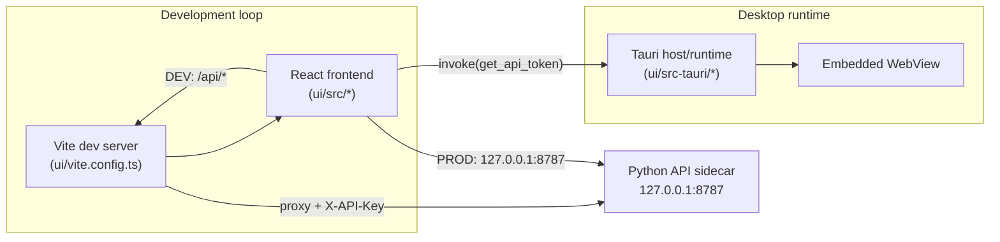

# Vite vs Tauri: Roles and Responsibilities (MVP)

Requirements: SYS-001, SEC-ACC-004, SEC-NET-001, SEC-NET-002, SEC-DATA-004

## Problem statement
This project uses both Vite and Tauri in the UI stack. Team members need a
clear boundary for what each one owns so development, security controls, and
desktop packaging stay consistent with the MVP architecture.

## Architecture overview

## Differences at a glance
| Area | Vite | Tauri |
|---|---|---|
| Primary role | Frontend toolchain (dev server + bundling) | Native desktop host/runtime + packaging |
| Active when | `npm run dev`, `npm run build`, frontend tests | `npm run tauri dev`, `npm run tauri build`, installed app runtime |
| Owns | TypeScript/React asset pipeline and dev proxy | Window lifecycle, app identity, CSP/capabilities, native bundles |
| API path behavior | Dev proxy `/api/*` -> `127.0.0.1:8787` | Runtime command bridge (`invoke`) and WebView security policy |
| Secret handling in current setup | Injects `X-API-Key` from env in proxy path (dev only) | Supplies token to UI via `get_api_token` command |
| Does not own | Native packaging, desktop permissions/capabilities | React bundling/HMR/dev proxy |

## Vite responsibilities in this repository
- Serve the React UI quickly in development, including HMR (`ui/package.json`,
  `dev` script).
- Build frontend assets for distribution (`build` script uses `tsc && vite build`).
- Provide the development API proxy in `ui/vite.config.ts`:
  - rewrites `/api/*` to `http://127.0.0.1:8787/*`
  - injects `X-API-Key` from `GODZILLA_API_TOKEN` server-side in dev
- Keep frontend behavior consistent across environments by allowing the API
  client to use `/api` in dev and direct loopback URL in production
  (`ui/src/api/client.ts`).

Vite is a frontend build/development tool only. It is not the desktop security
boundary and it is not responsible for native app packaging.

## Tauri responsibilities in this repository
- Host the desktop app runtime (`ui/src-tauri/src/main.rs`,
  `ui/src-tauri/src/lib.rs`).
- Expose runtime-only commands to the UI:
  - `get_api_token` returns `GODZILLA_API_TOKEN` from process environment.
- Define desktop app metadata and runtime policy (`ui/src-tauri/tauri.conf.json`):
  - app identity (`identifier`, `productName`)
  - window settings (title, size constraints)
  - CSP (`connect-src` loopback API)
  - native bundling targets/icons
- Orchestrate UI toolchain during Tauri flows:
  - `beforeDevCommand: npm run dev`
  - `devUrl: http://localhost:1420`
  - `beforeBuildCommand: npm run build`
  - `frontendDist: ../dist`

Tauri is the desktop shell and distribution layer. It should remain responsible
for native/runtime concerns, not frontend compilation details.

## Responsibility boundary and handoff
- Development with desktop shell:
  - `tauri dev` starts Vite and loads the Vite `devUrl` inside WebView.
- Browser-only development (for container workflows):
  - Vite can run directly and proxy API calls without Tauri.
- Production desktop builds:
  - Vite output (`dist`) is consumed by Tauri for packaged binaries.

This separation keeps the stack aligned with the MVP goal: React/Vite for fast
UI iteration, Tauri for secure local desktop runtime and packaging.
